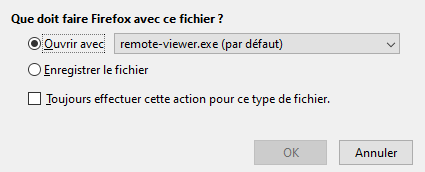

# Utilisation des VMs au lycée

{width=50%}

## Principe
Afin de pouvoir travailler sous le système d'exploitation libre Linux sur les machines du lycée (sous Windows), nous utilisons la solution de virtualisation Proxmox. 

De manière simplifiée : 

- un serveur (assez puissant) se trouve dans la salle serveur du lycée ;
- sur cet ordinateur, un grand nombre de systèmes d'exploitation peuvent être démarrés indépendamment ;
- une VM est dispo par élève : c'est ta machine virtuelle (ta VM : Virtual Machine) ;
- tu te connectes à ta VM depuis un navigateur de n'importe quel ordinateur du lycée ;
- cet ordinateur (appelé *hôte*) ne va faire que recevoir le flux vidéo venu du serveur (et lui envoyer les interactions utilisateurs : souris, clavier) ;
- en mettant ce flux vidéo en plein écran, on a l'illusion d'être sous un nouveau système d'exploitation. Nous allons donc travailler sous Linux, tout en restant en réalité sur Windows.

## Procédure

1. Ouvrir le navigateur Firefox et entrer l'adresse suivante :
      
   https://172.18.107.248:8006
   
2. Une alerte de sécurité apparaît :

 
   
3. Cliquer sur `Avancé...`, un autre message s'affiche en-dessous :
    
 

4. Cliquer sur `Accepter le risque et poursuivre` 
   
5. La fenêtre de connexion `Proxmox VE Login` s'ouvre :

6. Avant de renseigner son nom d'utilisateur et son mot de passe, il faut sélectionner dans Realm : `Proxmox VE authentication server` et dans Langue : `French`, la fenêtre est maintenant intitulée `Authentication Proxmox VE` comme ci-dessous :

7. Renseigner son nom d'utilisateur et son mot de passe puis cliquer sur `Login`.
8. Un message d'avertissement apparaît ("Aucune clé d'enregistrement valide"). Cliquer `OK` pour l'ignorer.
9.  Dans la colonne de gauche, sélectionner sa machine virtuelle (VM) sous `Datacenter > SVR-10-ORN`, exemple `112(XUB1)`
10. En haut à droite, cliquer sur `Démarrer` pour démarrer la VM (ou clic droit sur la VM puis sélectionner `Démarrer`)
11. Cliquer sur le bouton `Console` et choisir `Spice` (ou clic droit sur la VM puis sélectionner `Console`).
12. La fenêtre ci-dessous s'affiche : 

13.  Cliquer `OK`.
14.  Attendre (un peu).
15. Si rien ne se passe au bout d'une dizaine de secondes, fermer la fenêtre et cliquer de nouveau sur `Spice` puis sur `OK`.
16. Remplir ses identifiants dans la fenêtre de connexion :
    - login : test
    - mdp : nsispeinfo
	
    

17. Dans Paramètres > Affichage puis modifier la résolution en 1920x1080 enfin basculer l'affichage en plein écran en cliquant sur  en haut à droite dans Spice.
Résultat :

18. Au premier lancement du navigateur de la VM, cliquer sur `Afficher la page de connexion du réseau` 

19. Remplir ses identifiants de session Windows, pour être autorisé à accéder au réseau Internet par l'intermédiaire d'ALCASAR-ORN :

20. S'ouvre alors une fenêtre qui prévient "Attention : vous serez déconnecté si vous fermez cette fenêtre". Utiliser alors un autre onglet pour aller sur Lycée connecté.

