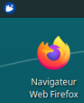

# Utilisation de machines virtuelles (VM) au lycée

## Principe

Afin de pouvoir travailler sous le système d'exploitation libre GNU / Linux sur les machines du lycée (sous Windows), nous utilisons la solution de virtualisation Proxmox. Elle est fournie par la Région qui exécute Proxmox sur un serveur, cet environnement virtualisé est organisé sous forme de bulle isolée du réseau pédagogique du lycée mais pas d'Internet.

De manière simplifiée :

- un serveur (assez puissant) se trouve dans la salle serveur du lycée ;
- sur ce serveur, un grand nombre de systèmes d'exploitation peuvent être démarrés indépendamment ;
- une VM est disponible par élève : c'est sa machine virtuelle (VM : Virtual Machine) exécutée sur le serveur `Proxmox` du lycée ;
- l'élève se connecte à sa VM depuis un navigateur de n'importe quel ordinateur du lycée ;
- cet ordinateur (le client) ne va faire que recevoir le flux vidéo venu du serveur `Proxmox` et lui envoyer les interactions utilisateurs : clavier et souris ;
- en mettant ce flux vidéo en plein écran, on a l'illusion d'être sous un nouveau système d'exploitation. Nous allons donc travailler sous Linux, tout en restant en réalité sur Windows ;
- chaque élève a accès à Internet en entrant ses identifiants et mot de passe habituels du réseau pédagogique sur une application nommée ALCASAR (Application Libre pour le Contrôle d'Acccès Sécurisé et Authentifié au Réseau).

## Procédure à suivre pour ouvrir utiliser sa VM

- Ouvrir le navigateur Firefox et entrer l'adresse suivante : <https://172.18.107.248:8006>

- Une alerte de sécurité apparaît :

- Cliquer sur `Avancé...`, un autre message s'affiche en-dessous :
  

- Cliquer sur `Accepter le risque et poursuivre`
  
- La fenêtre de connexion `Proxmox VE Login` s'ouvre :
  

- Avant de renseigner son nom d'utilisateur et son mot de passe, il faut sélectionner dans Realm : `Proxmox VE authentication server` et dans Langue : `French`, la fenêtre est maintenant intitulée `Authentication Proxmox VE` comme ci-dessous :

- Renseigner son nom d'utilisateur `Proxmox` et son mot de passe puis cliquer sur `Login` (les identifiants Proxmox sont donnés par le prof).

- Un message d'avertissement apparaît ("Aucune clé d'enregistrement valide"). Cliquer `OK` pour l'ignorer.

- Dans la colonne de gauche de la page `Proxmox`, sélectionner sa machine virtuelle (VM) sous `Datacenter > SVR-10-ORN`, exemple `112(XUB1)`
  
- En haut à droite de la page `Proxmox`, cliquer sur `Démarrer` pour démarrer la VM (ou clic droit sur la VM puis sélectionner `Démarrer`)

- Cliquer sur le bouton `Console` et choisir `Spice` (ou clic droit sur la VM puis sélectionner `Console`).
  
- La fenêtre ci-dessous s'affiche :

- Cliquer `OK` et attendre un peu.

- Si rien ne se passe au bout d'une dizaine de secondes, fermer la fenêtre et cliquer de nouveau sur `Spice` puis sur `OK`.

- Si tout s'est bien passé, le client de connexion `Spice` permet d'obtenir la distribution Linux : Xubuntu exécutée par la machine virtuelle.

- Renseigner ses identifiants dans la fenêtre de connexion à `Xubuntu`, si la connexion n'est pas automatique :
  - login : test
  - mot de passe : nsispeinfo

 Ainsi, chaque élève a pour nom d'utilisateur `test` dans `Xubuntu`

- Basculer l'affichage en plein écran en cliquant sur  en haut à droite dans `Spice`.

- Au premier lancement de `Firefox` sur `Xubuntu`, cliquer sur `Afficher la page de connexion du réseau`

- Remplir ses identifiants de session Windows, pour être autorisé à accéder au réseau Internet par l'intermédiaire d'ALCASAR-ORN :

- S'ouvre alors une fenêtre qui prévient "Attention : vous serez déconnecté si vous fermez cette fenêtre". Utiliser alors un autre onglet du navigateur pour aller sur Lycée connecté par exemple.

- Pour arrêter une VM, faire simplement une déconnexion en cliquant sur l'icône bleu  en haut à gauche du bureau Xubuntu puis choisir d'éteindre. Ainsi, dans la page `Proxmox`, on verra bien que la VM est stoppée.

- Pour se déconnecter de ``Proxmox``, aller en haut à droite de la fenêtre et cliquer sur la flêche du bas puis sur ``Déconnexion`` 

**Remarque** : dans cette version de Proxmox associée à Windows 10, l'utilisateur n'a pas accès au port USB, on ne peut pas donc utiliser de clé USB ni programmer de carte micro:bit ou Arduino. Pour récupérer ou enregistrer des fichiers, on pourra utiliser `Documents` et `Documents partagés` de `Lycée connecté`.
